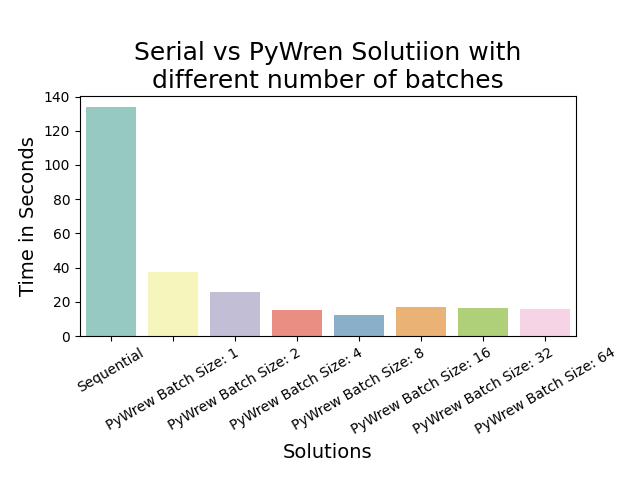
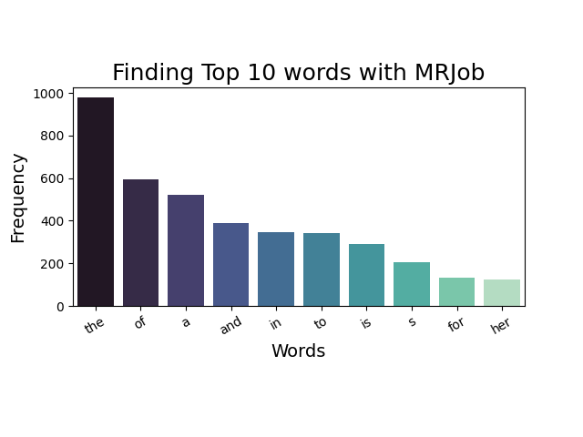

# MACS 30123: Large Scale Computing
## Assignment 2
## Andrei Bartra
***

## 1 Parallel Web Scraping with `PyWren`
### 1.a Execution Time Comparisson and Bottlenecks

Code: A2_Q1_AB.py

First, I did some modifications to the original sequential solutions:

- The writing into memory feature is now independent. It is easy to change the database system implementation (`database`, `sqlite3`, `psycopg2`, etc.). For this exercise, I used pandas with csv files. To keep it simple. 
- The writing into memory can now be done in batches. That way, the process is more efficient. For this exercise, I chose a batch size larger than the data to make just one writing operation. The file size was not big enough to compromise the RAM capacity.

The PyWren implementation parallelizes the individual book scraping. It is 6.5 times faster on average relative to the sequential solution (~15% of the time).

The optimum batch size was 4 (searching on powers of 2 of batch size). There is a trade-off between speed-up due to parallelization and the time it takes to set up a parallel instance. 

On the other hand, the process has bottlenecks that limit parallelization efficiency via `PyWren`. The size of the data allowed me to handle everything with RAM. However, on a larger scale, the problem and the parallel solution via PyWren would have to be done in batches. 

Another bottleneck is the initial collection of book ids. The problem is that not knowing the number of pages beforehand makes it more difficult to call `PyWren` map function. 

### 1.b AWS storage solutions

It is easy to manage the data storage locally in the current state. The amount of data does not overcome a regular RAM capacity. If the scale of the data starts to make querying unmanageable, or there is a need for a more complex transactions infrastructure, it would be advisable to upgrade the database system. 

- **S3**: This is the first option to consider for a cloud-based storage system in AWS. One significant advantage is that it does not require structured data. It is convenient for web scraping tasks and exploratory analysis. The HTML file of each book can be stored as a whole and then processed on demand. Furthermore, having unstructured data allows more flexibility. You can approach the data from different angles and exploit features of the data that could get lost during the systematization. The main disadvantage of S3 is that it forces you to work on each object at a time. This characteristic makes it very inefficient to extract a feature for every object. Furthermore, S3 offers eventual consistency. If the project relies on accessing data from multiple terminals and is critical to have real-time replicability, S3 may not be the best option.
- **DynamoDB**: If the project requires prioritizing consistency, quick access to data groups, and the HTML files can be systematized in low-sized JSON files (< 4KB), then DynamoDB is a good option.  The main disadvantages are that data items must be low-sized, and traffic bursts can be challenging to handle. Moreover, an additional system would be required if the project needs to perform aggregation, joins, and sorts with values different from the key, recurrently.
- **Redshift**: Finally, if data can be structured as a relational database to perform SQL operations, Redshift is the best option. Redshift supports complex querying that could be suitable for data-science-related projects. The tradeoff with Redshift is that it does not ensures consistency like DynamoDB, and it is required highly structured data with well-designed DIST KEYS and SORT KEYS. 

## 2. Most-Used Words with `mrjob`

Code: A2_Q2_AB.py

## 3. Streaming Stock Data with `Kinesis`
Code: A2_Q3_AB.py, consumer.py, producer.py

Screenshot of the streaming service working:

Note the implementation of a feature to terminate the EC2 instances. This feature activates 5 minutes after the instances have been initialized.

Initially, I developed an implementation to terminate the instances remotely from the consumer EC2 (that is why I am also sending the Instances IDs via SCP). However, it also required the credentials file. It became a very laborious implementation. I decided to opt for a more straightforward solution 

### 3.a Kinesis Stream Service
Screenshot of the received email:

## 4. Final Project Proposal

I am developing this project alone. 

The Ministry of Education of Peru requires precise travel-time estimates from the center of cities to the schools and between schools for several critical processes, public policy design, and research.  

A challenging aspect for estimating travel times is the rugged Peruvian geography and lack of transportation infrastructure.  In a few hundred ok kilometers, one can go from a flat desert, pass through a 5,000-meter mountain range and end in a dense jungle. These characteristics invalid the simple euclidian distance as a good approximation. Furthermore, the lack of roads hinders the ability of Google to estimate travel times in rural areas correctly.

The ministry has a speed model, where the Peruvian territory is divided into a grid of 90m2 squares. Each square gets an estimated speed based on roads, water bodies, slope,  terrain characteristics, and chosen conveyance (car, walk, and boat). Currently, this process is run sequentially, locally, with licensed software (ArcGis) and requires substantial investment in hardware. As a result, a query of travel time estimates may last weeks and constant efforts to increase computing capacity. Furthermore, there are very few people, relative to the demand, with the skills required to program a travel time query. 

I propose to develop a parallelized version of the process with the following features:

- **Outputs**: Travel time between two sets of coordinates. Alternatively, [isochrone areas](https://en.wikipedia.org/wiki/Isochrone_map)  from a set of coordinates. 
- **Low skill setup**: It should only be required to input lists of coordinates and parameters; install a python virtual environment and have an AWS if desired. 
- **Versatile**: It should be possible to run locally (MPI + Numba) or using AWS  (PyWren or Custom Setup with Boto3)

